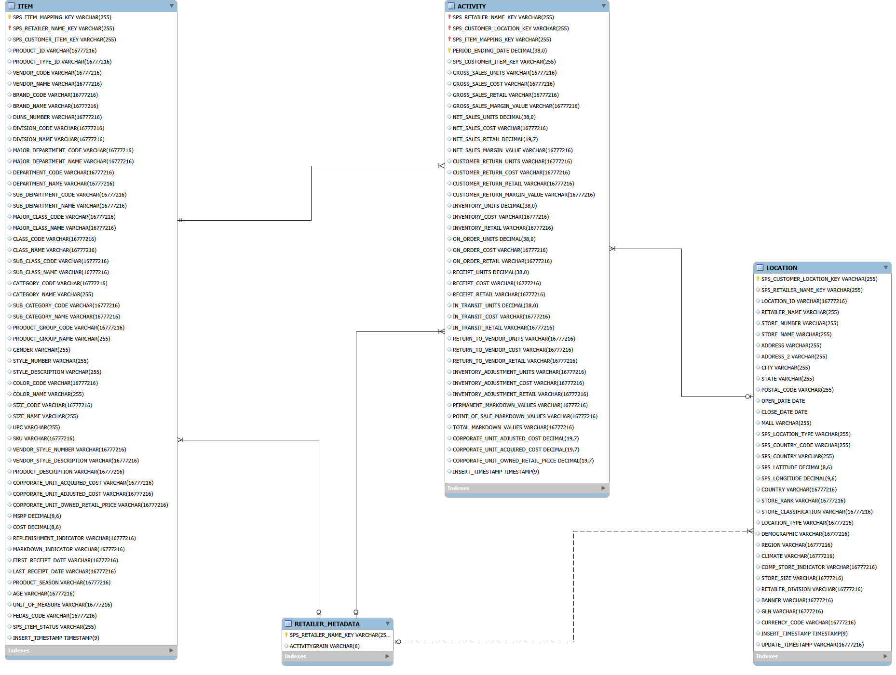
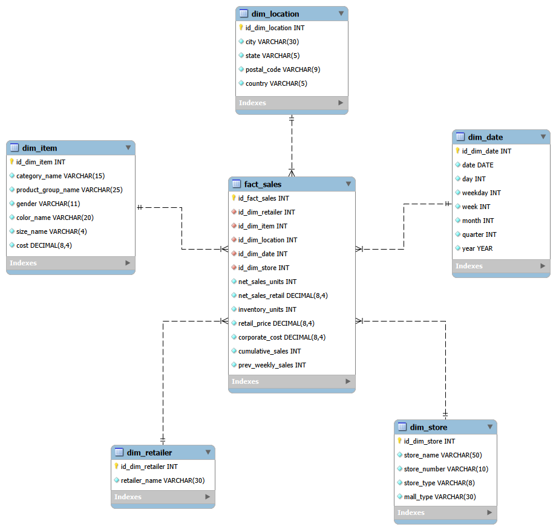
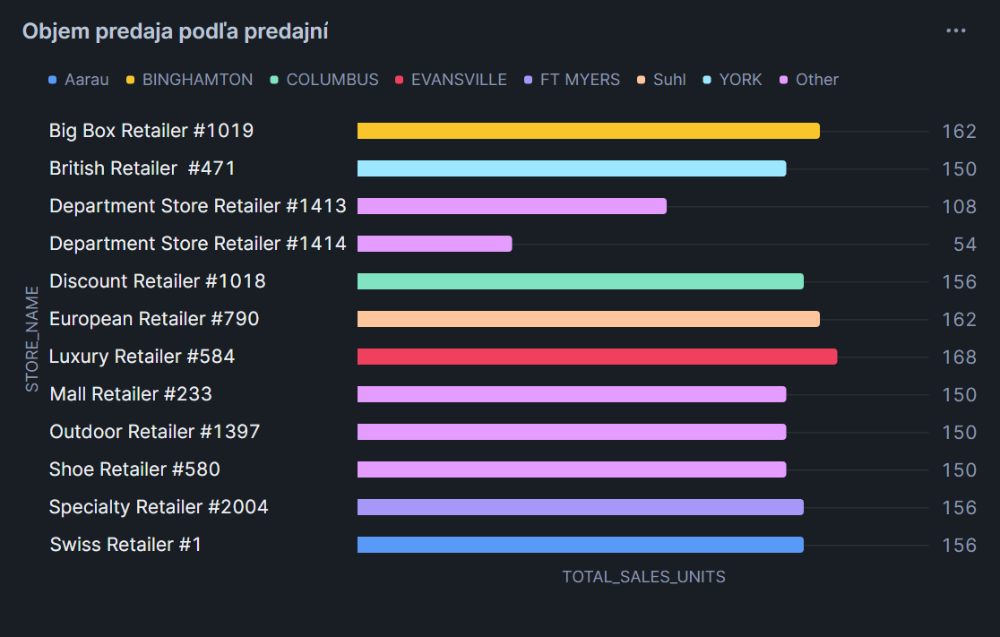
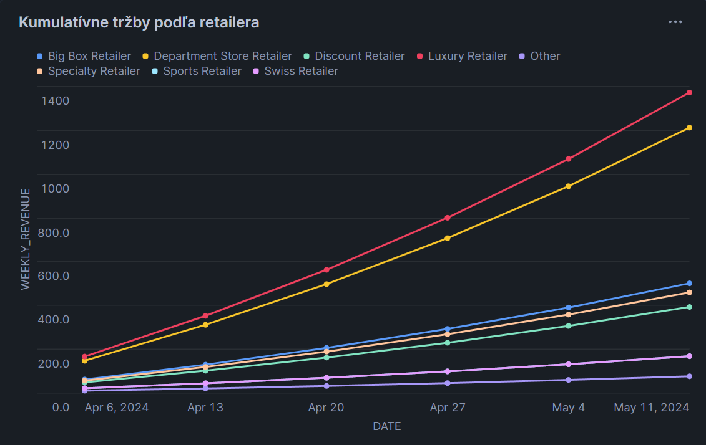
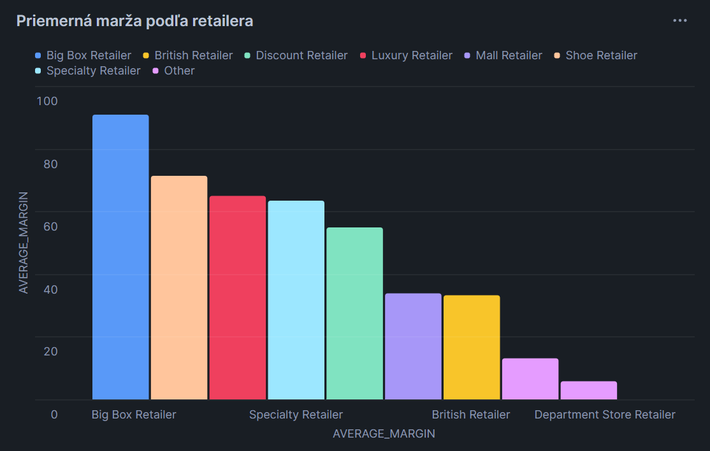
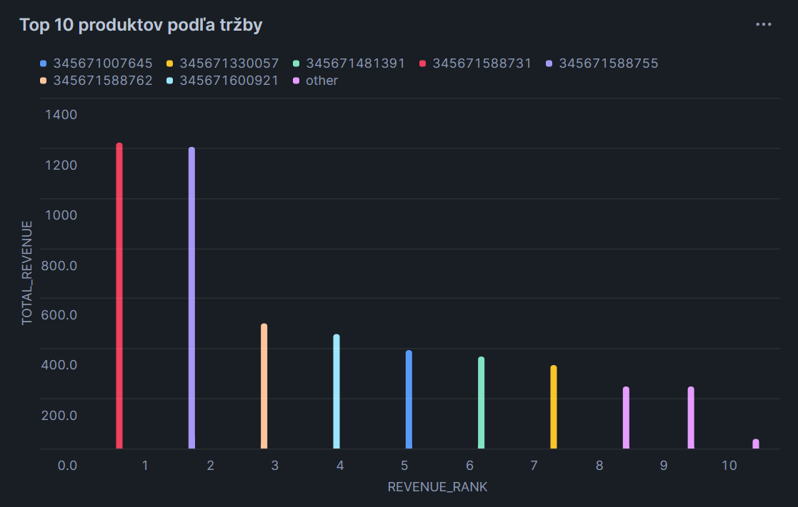
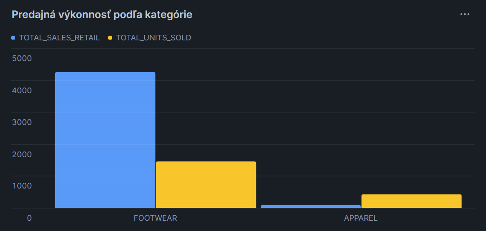
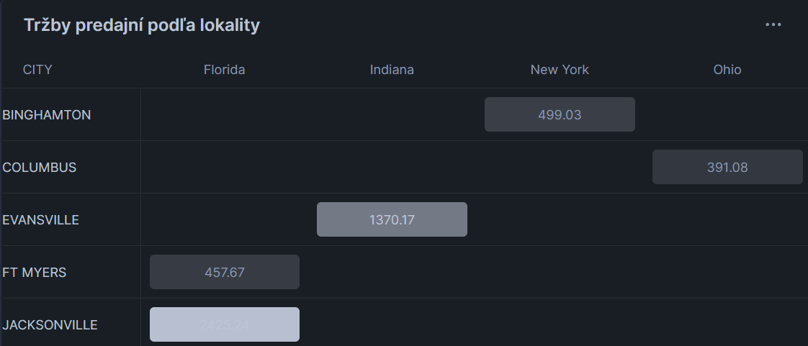

# ELT proces pre dataset Sales and Inventory Data for Retail Business Intelligence
---
## 1. Úvod a popis zdrojových dát
V rámci záverečného projektu sme sa rozhodli pracovať s free datasetom **Sales and Inventory Data for Retail Business Intelligence** zo **Snowflake Marketplace**, poskytovaným spoločnosťou **SPS Commerce**. 
Témou projektu je analýza predaja a výkonnosti produktov a predajní v maloobchodnom prostredí.
Cieľom je vytvoriť dátový sklad (DWH) a implementovať ELT proces v prostredí Snowflake. 

Zvolený dataset obsahuje dáta z maloobchodného prostredia, poskytuje prehľad o predaji, zásobách a produktoch v rôznych predajniach. Pokrýva obdobie šiestich týždňov.

Vybrali sme si ho, pretože je voľne dostupný a obsahuje dáta, ktoré nám umožňujú vytvoriť dátový sklad a analyzovať predajné trendy a výkonnosť retailového biznisu.

Dataset podporuje biznis proces analýzy výkonnosti maloobchodného predaja. Cieľom tohto procesu je sledovanie a vyhodnocovanie predaja produktov, tržieb a marže naprieč retailermi, predajňami a geografickými lokalitami v čase. Analýza je zameraná na identifikáciu najvýkonnejších predajní a produktov, sledovanie vývoja tržieb v čase a hodnotenie ziskovosti predaja.

**Popis zdrojových tabuliek datasetu:**

Dataset obsahuje tieto štyri tabuľky:

- **ACTIVITY** - metriky predaja a zásob

Tabuľka `ACTIVITY` zahŕňa metriky predaja a stavu zásob zaznamenávané na týždennej úrovni pre jednotlivé produkty, predajne a retailerov.
Obsahuje údaje o počte predaných kusov (NET_SALES_UNITS), tržbách (NET_SALES_RETAIL), stave zásob (INVENTORY_UNITS), nákladových a predajných cenách produktov.
Táto tabuľka je zdrojom dát pre tvorbu faktovej tabuľky v dátovom sklade a slúži na analýzu vývoja predaja a tržieb v čase.

- **ITEM** - údaje o produktoch a ich kategorizácia

Tabuľka `ITEM` obsahuje informácie o produktoch predávaných v maloobchodnej sieti. 
Zahŕňa údaje o kategórii produktu (CATEGORY_NAME), produktovej skupine (PRODUCT_GROUP_NAME), pohlaví, farbe, veľkosti, identifikátoroch produktu (UPC, štýlové číslo) a nákladovej cene produktu. 
Tieto údaje tvoria základ dimenzie produktu a umožňujú analyzovať predaj podľa produktových vlastností a kategórií.

- **LOCATION** - informácie o predajných lokalitách

Tabuľka `LOCATION` obsahuje informácie o fyzických predajných lokalitách. Uchováva údaje o názve predajne, čísle predajne, meste, štáte, PSČ, krajine, type predajne (kamenná predajňa/online predaj) a type nákupného centra.
Slúži ako zdroj pre dimenziu lokality a predajne a umožňuje geografickú analýzu výkonnosti predaja a porovnanie jednotlivých predajní a regiónov. 

- **RETAILER_METADATA** - doplnkové informácie o retaileroch a granularita dát

Tabuľka `RETAILER_METADATA` obsahuje metadáta o jednotlivých retaileroch a definuje granularitu dát v zdrojovom datasete.
Zahŕňa identifikátor retailera a informáciu o úrovni agregácie dát (ACTIVITYGRAIN). 
Táto tabuľka je využitá na tvorbu dimenzie retailera a podporuje analýzu výkonnosti jednotlivých predajcov.

V rámci popisu zdrojových tabuliek uvádzame iba tie stĺpce, ktoré sú relevantné. Stĺpce s výhradne NULL hodnotami nezahŕňame v opise.

---
## 1.1 Dátová architektúra

### ERD diagram pôvodnej dátovej štruktúry
Diagram zobrazuje hlavné entity a atribúty datasetu a vzťahy medzi entitami.


*Obr. 1 - Entitno-relačný diagram (ERD) pôvodnej dátovej štruktúry:*

---
## 2. Dimenzionálny model
Navrhnutá Star Schema je tvorená jednou tabuľkou faktov a piatimi dimenzionálnymi tabuľkami.
- **fact_sales** - tabuľka faktov, ktorá predstavuje metriky predaja a obsahuje atribúty:
  - `id_fact_sales` - primárny kľúč
  - `id_dim_retailer`, `id_dim_item`, `id_dim_location`, `id_dim_date`, `id_dim_store` - cudzie kľúče napojené na všetky dimenzie
  - `net_sales_units`- počet predaných kusov
  - `net_sales_retail` - tržby z predaja
  - `inventory_units` - počet kusov na sklade
  - `retail_price` - maloobchodná cena
  - `corporate_cost` - nákladová cena
  - `cumulative_sales`, `prev_weekly_sales` - kumulatívny súčet predaných kusov a predaj z predchádzajúceho týždňa, tieto stĺpce sú vypočítané pomocou window functions
    
Window functions použité vo fact_sales:
```sql
SUM(a.net_sales_units) OVER (PARTITION BY a.sps_item_mapping_key , a.sps_customer_location_key ORDER BY a.period_ending_date) AS cumulative_sales,
LAG(a.net_sales_units) OVER (PARTITION BY a.sps_item_mapping_key , a.sps_customer_location_key ORDER BY a.period_ending_date) AS prev_weekly_sales 
```

- **dim_item** - dimenzia produktu, obsahuje id, kategóriu produktu, skupinu, farbu, veľkosť, pohlavie a cenu za kus. SCD Typ 2
- **dim_location** - dimenzia lokality, obsahuje id, mesto, štát, PSČ a krajinu. SCD Typ 1
- **dim_retailer** - dimenzia predajcu, obsahuje id, názov predajcu. SCD Typ 3
- **dim_store** - dimenzia predajne, obsahuje id, názov predajne, číslo, typ predajne, a typ nákupného centra, v ktorom sa nachádza. SCD Typ 1
- **dim_date** - dimenzia času, obsahuje id, dátum, deň, týždeň, mesiac, kvartál a rok. SCD Typ 0

**Všetky dimenzie majú k faktovej tabuľke vzťah 1:N**

---
**Star schema:**


*Obr. 2 - Hviezdicový model (Star Schema)*

---
## 3. ELT proces v Snowflake
Zdrojové dáta pochádzajú zo Snowflake Marketplace, z free datasetu **SALES_AND_INVENTORY_DATA_FOR_RETAIL_BUSINESS_INTELLIGENCE** a konkrétne z jeho schémy **PUBLIC** (Extract).
Dáta zo zdroja sme načítali do staging tabuliek(Load), z ktorých sme následne pomocou SQL transformácií vytvorili finálne dimenzie a faktovú tabuľku v dátovom sklade(Transform).

### 3.1 Staging tabuľky
Staging tabuľky slúžia na uloženie dát načítaných zo zdrojového datasetu pred ich transformáciou do dimenzií a faktovej tabuľky.
V týchto tabuľkách sú zahrnuté len relevantné stĺpce.

**Vytvorenie activity_staging**

```sql
CREATE OR REPLACE TABLE activity_staging AS 
SELECT 
    SPS_CUSTOMER_ITEM_KEY,
    SPS_RETAILER_NAME_KEY,
    SPS_CUSTOMER_LOCATION_KEY,
    SPS_ITEM_MAPPING_KEY,
    PERIOD_ENDING_DATE,
    NET_SALES_UNITS,
    NET_SALES_RETAIL,
    INVENTORY_UNITS,
    ON_ORDER_UNITS,
    RECEIPT_UNITS,
    IN_TRANSIT_UNITS,
    CORPORATE_UNIT_ADJUSTED_COST,
    CORPORATE_UNIT_ACQUIRED_COST,
    CORPORATE_UNIT_OWNED_RETAIL_PRICE
FROM SALES_AND_INVENTORY_DATA_FOR_RETAIL_BUSINESS_INTELLIGENCE.PUBLIC.ACTIVITY;
```
Týmto spôsobom boli vytvorené aj zvyšné staging tabuľky - `item_staging`, `location_staging`, `retailer_staging` - ktorých tvorba je zobrazená v súbore *extract_load.sql*.

---
### 3.2 Dimenzie
Zo staging tabuliek sme vytvorili finálne dimenzie `dim_item`, `dim_location`, `dim_retailer`, `dim_store` a `dim_date`.

**Vytvorenie tabuľky dim_item**

```sql
CREATE OR REPLACE TABLE dim_item AS (
SELECT DISTINCT
    i.SPS_ITEM_MAPPING_KEY AS id_dim_item,
    CAST(i.CATEGORY_NAME AS VARCHAR(15)) AS category_name,
    CAST(i.PRODUCT_GROUP_NAME AS VARCHAR(25)) AS product_group_name,
    CAST(i.GENDER AS VARCHAR(11)) AS gender,
    CAST(i.COLOR_NAME AS VARCHAR(20)) AS color_name,
    CAST(i.SIZE_NAME AS VARCHAR(4)) AS size_name,
    CAST(i.COST AS NUMBER(8,4)) AS cost
FROM item_staging i    
);
```
Týmto spôsobom boli vytvorené aj zvyšné dimenzie, ktorých tvorba je zobrazená v súbore *transform.sql*.

---
### 3.3 Faktová fabuľka 
**Vytvorenie faktovej tabuľky fact_sales**

```sql
CREATE OR REPLACE TABLE fact_sales AS (
SELECT
    UUID_STRING() AS id_fact_sales,
    dr.id_dim_retailer,
    di.id_dim_item,
    dl.id_dim_location,
    dd.id_dim_date,
    ds.id_dim_store,
    a.NET_SALES_UNITS AS net_sales_units,
    CAST(a.NET_SALES_RETAIL AS NUMBER(8,4)) AS net_sales_retail,
    a.INVENTORY_UNITS AS inventory_units,
    a.CORPORATE_UNIT_OWNED_RETAIL_PRICE AS retail_price,
    a.CORPORATE_UNIT_ADJUSTED_COST AS corporate_cost,
    SUM(a.net_sales_units) OVER (PARTITION BY a.sps_item_mapping_key , a.sps_customer_location_key ORDER BY a.period_ending_date) AS cumulative_sales,
    LAG(a.net_sales_units) OVER (PARTITION BY a.sps_item_mapping_key , a.sps_customer_location_key ORDER BY a.period_ending_date) AS prev_weekly_sales 
FROM activity_staging a 
JOIN dim_retailer dr ON a.SPS_RETAILER_NAME_KEY = dr.id_dim_retailer
JOIN dim_item di ON a.SPS_ITEM_MAPPING_KEY = di.id_dim_item
JOIN dim_location dl ON a.SPS_CUSTOMER_LOCATION_KEY = dl.id_dim_location
JOIN dim_date dd ON a.period_ending_date = dd.id_dim_date
JOIN dim_store ds ON a.SPS_CUSTOMER_LOCATION_KEY = ds.id_dim_store
);
```
V rámci faktovej tabuľky sme využili aj window functions.

---
## 4. Vizualizácie

### 1. Objem predaja podľa predajní

Vizualizácia porovnáva jednotlivé predajne na základe celkového počtu predaných kusov.


*Obr. 3 - Graf č. 1 - Objem predaja podľa predajní*

Graf slúži na porovnanie výkonnosti jednotlivých predajní v rámci predajnej siete. 
Umožňuje identifikovať najvýkonnejšie a najmenej výkonné predajne z hľadiska objemu predaja.

Takáto analýza je dôležitá pre:
- podporu rozhodnutí o rozšírení siete predajní.

```sql
SELECT
    ds.store_name,
    dl.city,
    dl.state,
    SUM(fs.net_sales_units) AS total_sales_units
FROM fact_sales fs
JOIN dim_store ds ON fs.id_dim_store = ds.id_dim_store
JOIN dim_location dl ON fs.id_dim_location = dl.id_dim_location
WHERE dl.city != 'OTHER'
GROUP BY ds.store_name, dl.city, dl.state
ORDER BY total_sales_units DESC;
```

### 2. Kumulatívne tržby podľa retailera

Graf zobrazuje týždenné tržby jednotlivých retailerov a ich kumulatívny (narastajúci) vývoj tržieb v čase.


*Obr. 4 - Graf č. 2 - Kumulatívne tržby podľa retailera*

Vizualizácia umožňuje sledovať tempo rastu tržieb jednotlivých retailerov počas sledovaného obdobia.
Kumulatívna krivka ukazuje, ako rýchlo jednotliví retaileri generujú tržby a či ich rast:
- zrýchľuje,
- stagnuje,
- alebo spomaľuje.

```sql
SELECT 
    dd.date,
    dr.retailer_name,
    SUM(fs.net_sales_retail) AS weekly_revenue,
    SUM(SUM(fs.net_sales_retail)) OVER ( 
        PARTITION BY dr.retailer_name 
        ORDER BY dd.date
    ) AS cumulative_revenue_by_retailer
FROM fact_sales fs
JOIN dim_date dd ON fs.id_dim_date = dd.id_dim_date
JOIN dim_retailer dr ON fs.id_dim_retailer = dr.id_dim_retailer
GROUP BY dd.date, dr.retailer_name
ORDER BY dr.retailer_name, dd.date;
```

### 3. Priemerná marža podľa retailera

Graf zobrazuje priemernú maržu jednotlivých retailerov, vypočítanú ako rozdiel medzi predajnou cenou a nákladmi.


*Obr. 5 - Graf č. 3 - Priemerná marža podľa retailera*

Vizualizácia umožňuje porovnať, ktorí retaileri sú najziskovejší, nie len najväčší z hľadiska objemu predaja.
Retailer s nižšími tržbami môže mať vyššiu maržu, a teda lepšiu ziskovosť.

```sql
SELECT 
    dr.retailer_name,
    ROUND(SUM((retail_price - corporate_cost) * net_sales_units) 
    / NULLIF(SUM(net_sales_units), 0),2) 
    AS weighted_avg_margin
FROM fact_sales fs
JOIN dim_retailer dr ON fs.id_dim_retailer = dr.id_dim_retailer
GROUP BY dr.retailer_name
ORDER BY weighted_avg_margin DESC
LIMIT 10;
```

### 4. Top 10 produktov podľa tržby

Vizualizácia zobrazuje stupnicu 10 najvýnosnejších produktov na základe celkových tržieb z predaja.


*Obr. 6 - Graf č. 4 - Top 10 produktov podľa tržby*

Graf identifikuje produkty, ktoré generujú najväčší podiel na tržbách.
(Pre identifikáciu produktu sme museli použiť iba ID, keďže dataset neposkytoval konkrétny názov produktu.)

```sql
SELECT 
    di.id_dim_item AS product_id,
    di.category_name,
    di.product_group_name,
    di.gender,
    SUM(fs.net_sales_retail) AS total_revenue,
    SUM(fs.net_sales_units) AS total_units_sold,
    ROW_NUMBER() OVER (ORDER BY SUM(fs.net_sales_retail) DESC) AS revenue_rank
FROM fact_sales fs
JOIN dim_item di ON fs.id_dim_item = di.id_dim_item
GROUP BY di.id_dim_item, di.category_name, di.product_group_name, di.gender
ORDER BY total_revenue DESC
LIMIT 10;
```

### 5. Predajná výkonnosť podľa kategórie

Vizualizácia porovnáva produktové kategórie na základe celkového počtu predaných kusov a celkových tržieb z predaja.


*Obr. 7 - Graf č. 5 - Predajná výkonnosť podľa kategórie*

Graf poukazuje na to, ktorá kategória je najviac predávaná objemovo a najvýznamnejšia z pohľadu tržieb.

Vizualizácia pomáha pri rozhodovaní:
- ktoré produkty akej kategórie sa oplatí mať v ponuke,
- o zameraní marketingu,
- úprave cien v prospech vyšších tržieb.

```sql
SELECT 
    di.category_name, 
    SUM(fs.net_sales_units) AS total_units_sold,
    SUM(fs.net_sales_retail) AS total_sales_retail
FROM fact_sales fs
JOIN dim_item di ON fs.id_dim_item = di.id_dim_item
GROUP BY di.category_name;
```

### 6. Tržby predajní podľa lokality

Graf zobrazuje celkové tržby z predaja pre jednotlivé predajne, rozdelené podľa krajiny, štátu a mesta.


*Obr. 8 - Graf č. 6 - Tržby predajní podľa lokality*

Vizualizácia poukazuje na finančne najvýkonnejšie predajne a regióny.

Graf je užitočný pri:
- porovnávaní výnosnosti jednotlivých lokalít,
- identifikácii regiónov s vysokou kúpyschopnosťou,
- investovaní do konkrétnych oblastí.

```sql
SELECT 
    ds.store_name,
    dl.country,
    dl.city,
    CASE 
        WHEN dl.state = 'FL' THEN 'Florida' 
        WHEN dl.state = 'IN' THEN 'Indiana' 
        WHEN dl.state = 'NY' THEN 'New York' 
        WHEN dl.state = 'OH' THEN 'Ohio' 
        ELSE 'Unknown' 
    END AS state_name,
    ROUND(SUM(fs.net_sales_retail),2) AS total_revenue
FROM fact_sales fs
JOIN dim_location dl ON fs.id_dim_location = dl.id_dim_location
JOIN dim_store ds ON fs.id_dim_store = ds.id_dim_store
WHERE dl.city != 'OTHER' AND dl.state != 'OTHER' AND net_sales_retail > 0
GROUP BY dl.country, dl.state, dl.city, ds.store_name
ORDER BY total_revenue DESC;
```
---
**Autorky: Adela Máčajová, Adriana Erniholdová**